# AWS_Account_Creation
## Project Goals and Learning Outcomes:
* Understand the basics of AWS Cloud and its importance for businesses and individuals.

* Successfuly create and ASW account and navigate through the set-up
* Access the AWS management console using the newly created account credentials
* Gain practical experience in using AWS services effectively for future projects and business needs.

## What is Cloud
The cloud refers to servers accessed over the Internet, along with the software and databases that run on those servers. It's used for storing, managing, and processing data instead of using local servers or personal computers. Here are the key points:

* **Storage**: Data can be stored in the cloud, making it accessible from any device with an internet connection.

* **Scalability**: Resources can be scaled up or down based on demand, making it cost-effective.

* **Accessibility**: Enables access to applications and data from anywhere in the world.

* **Collaboration**: Facilitates easy sharing and collaboration on documents and projects in real time.

## What is AWS Cloud

Amazon Web Services (AWS) is a comprehensive cloud computing platform provided by Amazon. It offers over 200 fully featured services, including computing power, storage, databases, machine learning, and artificial intelligence, among others1. Here are some key points about AWS:

* **Scalability**: AWS allows you to scale up or down based on your needs, making it cost-effective and flexible.

* **Global Reach**: AWS has data centers in multiple regions around the world, enabling you to deploy applications globally with low latency.

* **Security**: AWS is designed to be secure, with a wide range of security features and compliance certifications.

* **Innovation**: AWS continually innovates, offering new services and technologies to help businesses transform and grow.

* **Community**: AWS has a large and active community of customers and partners, providing support and resources for users.

## Importance of AWS Cloud

Amazon Web Services (AWS) is one of the most widely used cloud computing platforms globally, and it holds significant importance for various reasons:

* **Cost Efficiency**: AWS offers a pay-as-you-go pricing model, allowing businesses to save on costs by only paying for what they use. This eliminates the need for large upfront investments in hardware.

* **Scalability and Flexibility**: AWS allows businesses to easily scale their infrastructure up or down based on demand. This flexibility ensures that businesses can handle varying workloads without over-provisioning resources.

* **Global Reach**: With data centers located around the world, AWS enables businesses to deploy applications and services globally with low latency and high availability.

* **Security and Compliance**: AWS provides robust security features and compliance certifications, ensuring that data is protected and meets regulatory requirements. It includes features like encryption, identity and access management, and threat detection.

* **Innovation**: AWS continuously innovates by offering new services and technologies, such as machine learning, artificial intelligence, and the Internet of Things (IoT). This allows businesses to leverage cutting-edge technology to stay competitive.

* **Reliability and Performance**: AWS ensures high performance and reliability with its global infrastructure, which includes multiple availability zones and regions to prevent downtime and data loss.

* **Broad Range of Services**: AWS offers a wide variety of services, including computing, storage, databases, analytics, networking, mobile, developer tools, management tools, IoT, security, and enterprise applications. This comprehensive suite of services allows businesses to build virtually any type of application.

* **Ecosystem and Community**: AWS has a vast ecosystem of partners and a large user community, providing extensive support, resources, and integration options.

## Setting Up AWS Account

Setting up an AWS account is straightforward. Here are the steps to get you started:

* **Visit the AWS website**: Go to the AWS homepage.

* **Create an account**: Click on the "Create an AWS account" button.

  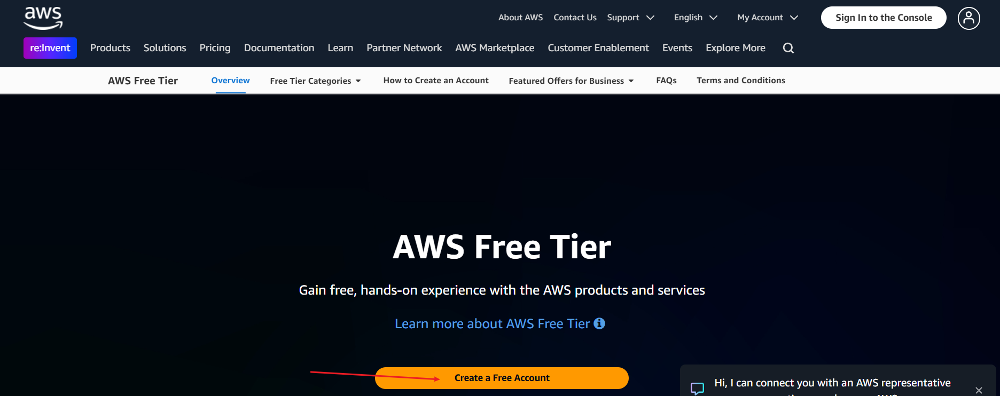

* **Enter your account information**: Fill in your email address, password, and account name.

  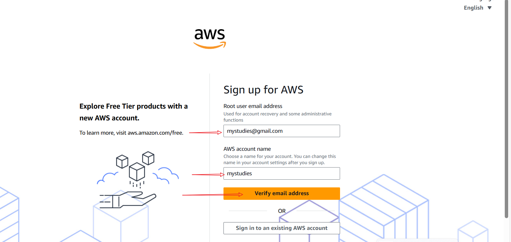

* **Verify your email address**: Check your email for a verification message from AWS and follow the instructions to verify your email.

  

  Input the code and verify the email thus:

  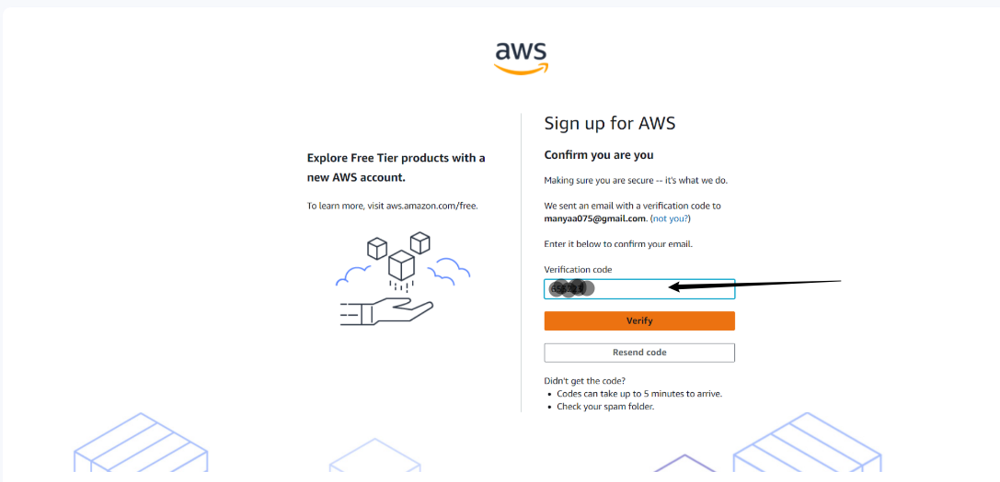

* **Set root User password** and Click continue.

    

* **Fill in your personal information**
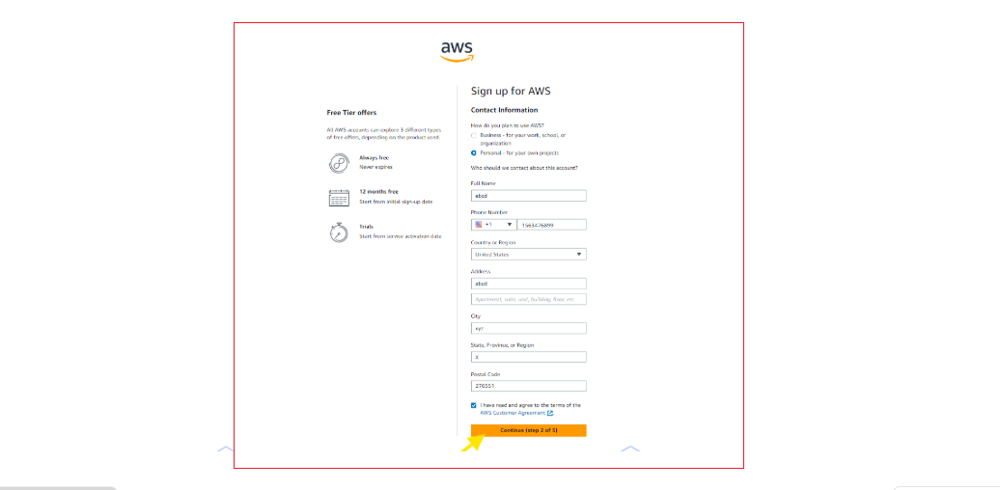

* **Add a payment method and Complete the payment method**: Enter your payment information (this is required for billing purposes, but you won't be charged unless you use paid services).Please note some debit and credit card companies may authorize the nominal charge of approximately $1.00 to validate the cards authenticity.Typically,this charged is reversed shortly after.

  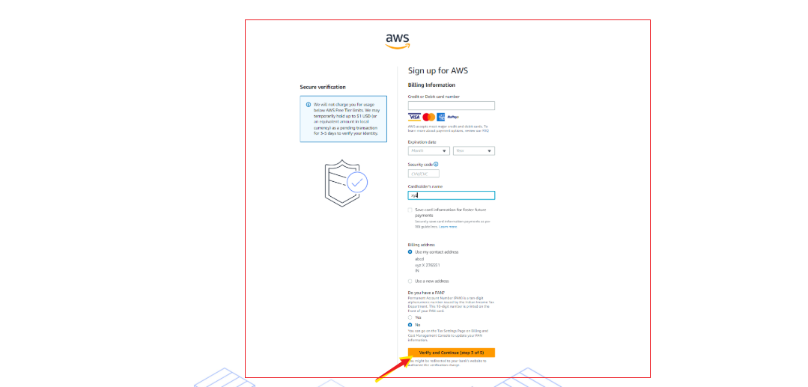

* **Choose an AWS Support plan**: Select a support plan that fits your needs (Basic, Developer, Business, or Enterprise).

  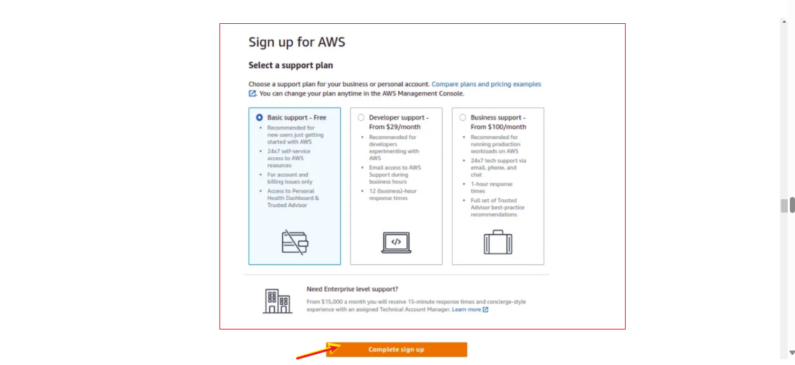

* **Complete the sign-up process**: Review and accept the AWS Customer Agreement, then complete the sign-up process.

  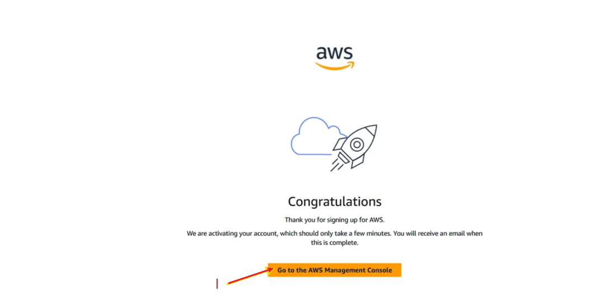

* **Once your account is set up, you can start exploring AWS services and resources**.

 ### After set up is completed,you can access the AWS management console using your account credentials
  * **Enter Personalize your experience** and click submit.

    

  * **Click sign in to the console**

    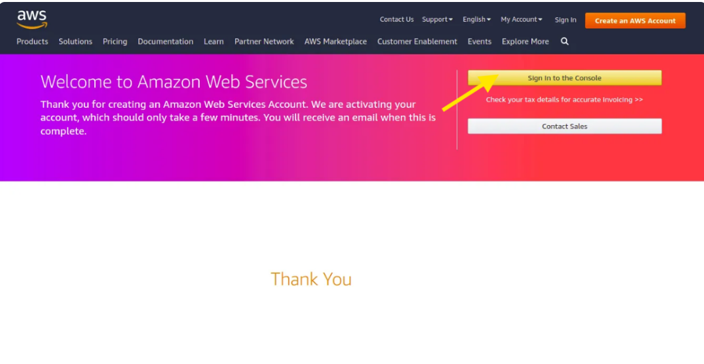

* **Select 'Root User' and enter your registered email address** and click next to proceed.

  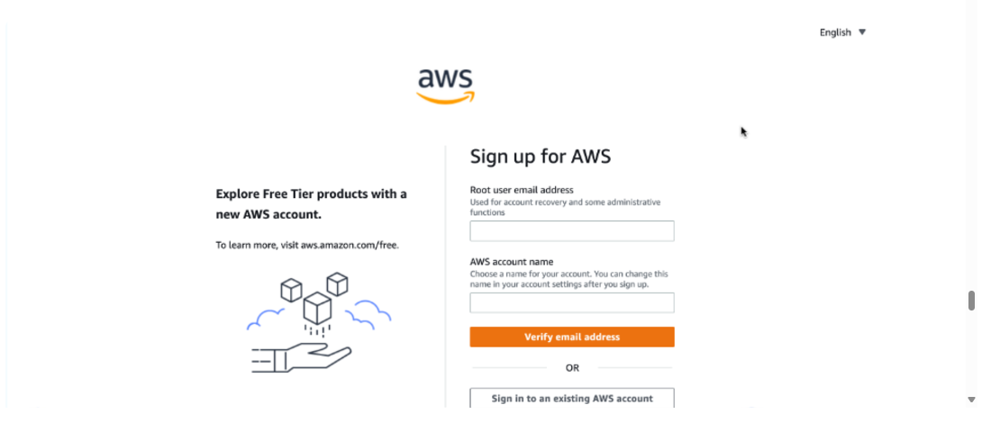

* **If a CAPTCHA is presented enter the display code** and click submit.

  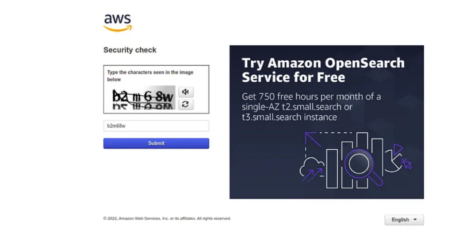

* **Enter root password** and click sign-in to proceed.
  
   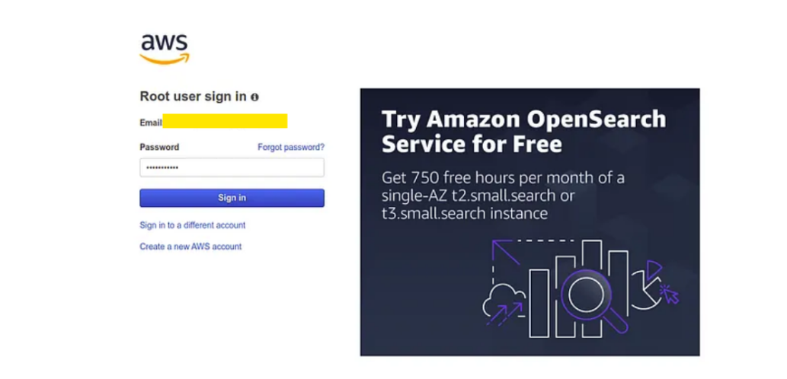

* **You have successfully logged into your AWS account**

  

# Project Conclusions.
In conclusion, setting up and managing an AWS account is a critical step for leveraging the extensive capabilities of cloud computing. AWS offers a robust, secure, and scalable platform that can transform how businesses operate, enabling them to innovate and scale efficiently. By following the step-by-step process of creating an account, adding a payment method, and selecting appropriate support plans, users can seamlessly integrate AWS into their operations.

The numerous services provided by AWS, such as computing power, storage solutions, and advanced analytics, empower users to build, deploy, and manage applications with ease. Additionally, AWS’s global infrastructure ensures high availability and performance, making it an ideal choice for businesses of all sizes.

Adopting AWS not only enhances operational efficiency but also opens up new avenues for growth and innovation. As businesses continue to adapt to the digital era, AWS stands out as a pivotal tool for achieving long-term success and staying competitive in the market.

By completing this project, users are well-equipped to harness the full potential of AWS, driving forward their strategic initiatives and gaining a significant technological advantage.
